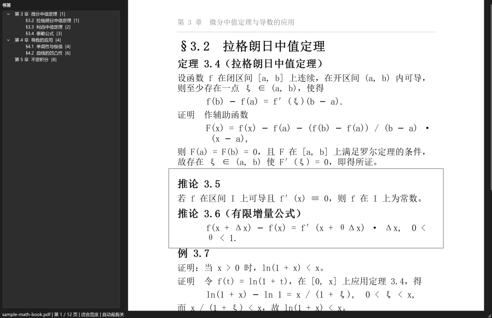
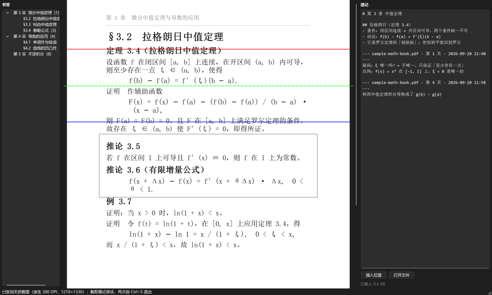
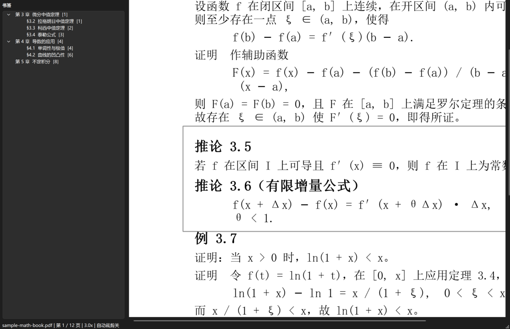
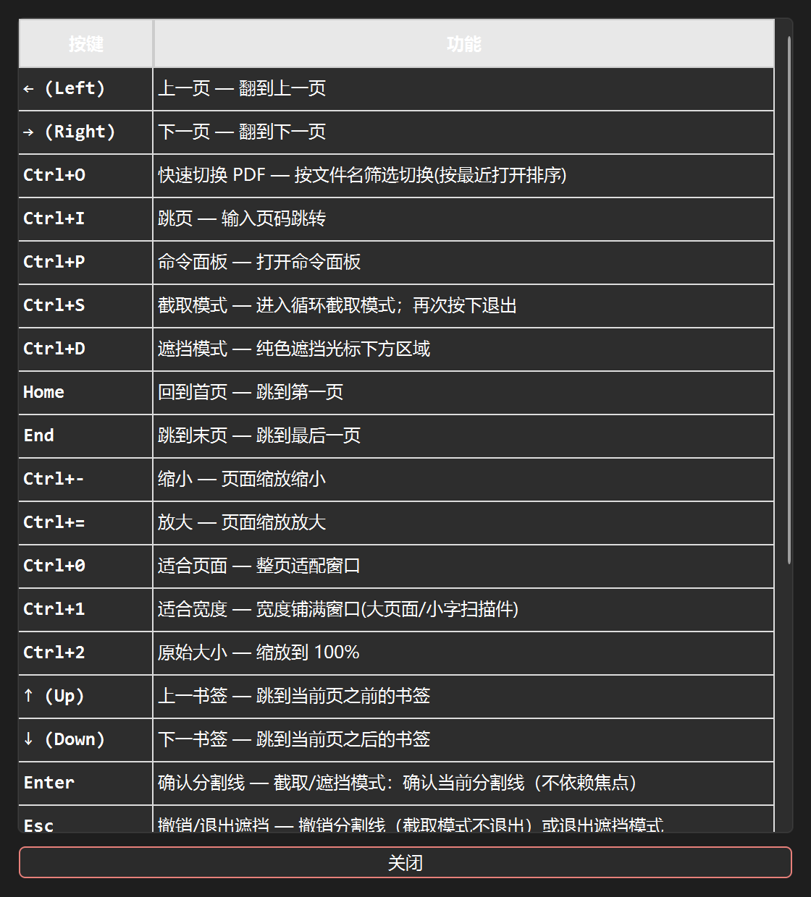
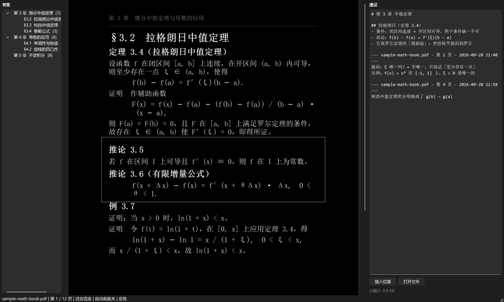

# PDF 阅读器（reader）

面向**啃扫描版数学书**的本地 PDF 阅读器：把「截一段去问 AI」做到最快（循环无损截取 + 跨页拼接），
同时解决大页面扫描件的阅读姿态与白边问题。

基于 **PySide6 + PyMuPDF**，单文件 `reader.py`，**纯本地、无网络依赖、不上传任何内容**。


## 界面截图

| 阅读：适合宽度 + 书签目录 | 循环截取：红=起始线　蓝=结束线　绿=预览线 |
|---|---|
|  |  |

| 放大看公式（3×，可拖拽平移） | 快捷键一览（`Ctrl+/`） |
|---|---|
|  |  |

> 截图取自程序真实界面，样例书为原创排版内容。

夜间反色显示（`Ctrl+Shift+I`）——同一页的黑底白字版本：



## 核心特性

- **循环无损截取**（`Ctrl+S`）：进入后一直保持，截完一次自动清空分割线可立即截下一张，
  **只有再按一次 `Ctrl+S` 才退出**——配合剪贴板直接粘给 AI
- **只渲染要截的区域，且分辨率按原图封顶**：扫描件绝不插值放大（实测最多省 17× 像素），
  跨页截取（起始线与结束线在不同页）自动纵向拼接
- **大页面阅读姿态**：适合页面 / **适合宽度** / 原始大小（`Ctrl+0`/`1`/`2`），放大后按住左键拖拽平移，双击切换
- **后台预取相邻页**：连续翻页实测 **0.7~1.0 ms/页**（未预取时 90~160 ms）
- **自动去白边**（默认关闭，`Ctrl+Shift+R`）：含扫描墨点过滤与灰底自适应，显示与截取共用同一套坐标映射
- **右侧速记栏**（`Ctrl+N`）：边看边写，停止输入即自动存到程序目录下的 `notes.md`；
  「插入位置」一键记下当前书名与页码，便于回溯原文
- **反色显示**（`Ctrl+Shift+I`）：白底黑字 ↔ 黑底白字，夜间看扫描件不刺眼。
  只改显示配色——**截取输出与去白边判定仍按原始像素**，发给 AI 的图永远是白底黑字
- 书签目录导航、阅读进度自动恢复、书签导出 Markdown、命令面板、快速切换 PDF
- 发布友好：不含任何机器路径，默认扫描**你自己**的「下载」文件夹，配置见下

> 截取模式刻意只做**两条横线 + 跨页拼接 + 原生分辨率输出**，与 PixPin 之类外部截图工具互补：
> 任意矩形框选交给外部工具，这里专做外部工具做不到的事。

## 快速开始

```bash
pip install -r requirements.txt      # PySide6、PyMuPDF、numpy
python reader.py                     # Windows 也可双击 run.bat
```

上手三步：

1. 启动后自动扫描并打开「下载」文件夹里的 PDF（用 `Ctrl+O` 按文件名快速切换、`F5` 重扫）
2. 按 `Ctrl+S` 进截取模式 → 鼠标定位 → 回车确认起始线 → 再定位 → 回车确认结束线 → 图已进剪贴板
3. 想看清小字：`Ctrl+1` 适合宽度，然后拖拽平移；`Ctrl+Shift+R` 可开启自动去白边

## 配置

所有配置项可选，优先级：**`reader_config.json` > 环境变量 > 默认值**。

```bash
copy reader_config.example.json reader_config.json     # Windows
```

| 键 | 环境变量 | 默认值 | 说明 |
|---|---|---|---|
| `pdf_root_dir` | `PDF_READER_PDF_ROOT_DIR` | 系统「下载」文件夹 | 启动时扫描/打开的 PDF 目录 |
| `state_dir` | `PDF_READER_STATE_DIR` | 同 `pdf_root_dir` | 阅读进度、最近打开记录的存放目录 |
| `notes_file` | `PDF_READER_NOTES_FILE` | `notes.md`（程序目录） | 速记文件；相对路径按程序目录解析 |
| `invert` | `PDF_READER_INVERT` | `false` | 启动即反色显示（夜间看扫描件） |
| `initial_pdf_keyword` | `PDF_READER_INITIAL_PDF_KEYWORD` | 空 | 启动时按文件名关键字自动打开 |
| `initial_page` | `PDF_READER_INITIAL_PAGE` | `1` | 无历史记录时的起始页 |

默认目录是**运行时算出来的**（仓库里不含任何机器路径）：Windows 先读注册表里系统认定的
「下载」文件夹（被移动过位置也能找到），拿不到再依次退回 `~/Downloads` → `~/Documents` → 用户主目录。
所以把这个包拷到别人机器上，它会落到**那个人自己**的下载目录。

`PDF_READER_LOG=DEBUG` 可打开被捕获异常的详细日志（默认只输出 warning 以上）。

## 文档

| 文档 | 内容 |
|---|---|
| [docs/USAGE.md](docs/USAGE.md) | 完整快捷键与鼠标操作、截取模式细节、书签与进度、常见问题 |
| [docs/DESIGN.md](docs/DESIGN.md) | 实现要点、实测性能数据、设计取舍、测试与打包 |

## 目录结构

```
pdf_reader/
├─ reader.py                    # 主程序（入口）
├─ requirements.txt             # 运行依赖
├─ reader_config.example.json   # 配置模板
├─ run.bat                      # Windows 双击启动
├─ LICENSE                      # MIT
├─ notes.md                     # 速记（运行时自动创建，已 gitignore）
├─ assets/reader.ico            # 窗口图标
├─ docs/                        # 使用说明 / 设计文档 / 截图
├─ tests/                       # 六套无头回归测试（147 项）
└─ tools/make_screenshots.py    # 重新生成 README 截图
```

## 许可

MIT License，见 [LICENSE](LICENSE)。
